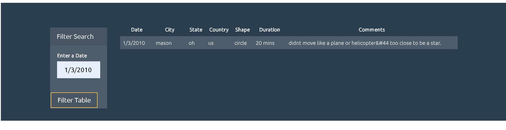

# JavaScript Homework - JavaScript and DOM Manipulation

## Project Overview
This project dynamically generates a table to explore and filter the provided UFO data.

Languages and libraries used:

* Javascript
* D3
* HTML
* CSS

--- 

## View the Site
The site can be viewed <a href="https://klharp.github.io/javascript-challenge/UFO-level-1/">HERE</a>. When on the initial page, click the text link `More Filter Options` to see the page with multiple filter capabilities.

- - -

## Level 1: Automatic Table and Date Search (Required)

* Used the provided HTML starter page and added customizations.

* Used the provided UFO datase in the form of an array of JavaScript objects, wrote code that appended a table to the web page and then added new rows of data for each UFO sighting.

* Using a date form,  wrote JavaScript code that listened for events and searched through the `date/time` column to find rows that match user input.

- - -

## Level 2: Multiple Search Categories 

* Completed all of Level 1 criteria.

* Used multiple `input` options. Wrote JavaScript code so the user can to set multiple filters and search for UFO sightings using the following criteria:

  1. `date/time`
  2. `city`
  3. `state`
  4. `country`
  5. `shape`

